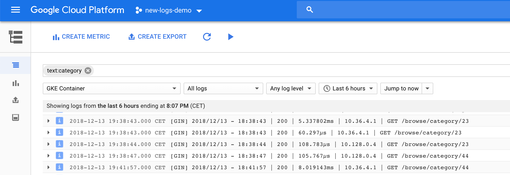

# Processing Logs at Scale Using Cloud Dataflow

This tutorial demonstrates how to use [Google Cloud Dataflow](http://cloud.google.com/dataflow) to analyze logs collected and exported by [Google Cloud Logging](http://cloud.google.com/logging). The tutorial highlights support for batch and streaming, multiple data sources, windowing, aggregations, and [Google BigQuery](http://cloud.google.com/bigquery) output.

For details about how the tutorial works, see [Processing Logs at Scale Using Cloud Dataflow](http://cloud.google.com/solutions/processing-logs-at-scale-using-dataflow) on the Google Cloud Platform website.

[TOC levels=3]: # " "

- [Architecture Overview](#architecture-overview)
- [Prerequisites](#prerequisites)
- [Sample Web Applications](#sample-web-applications)
    - [Deploy the Container Engine cluster](#deploy-the-container-engine-cluster)
    - [Set up Cloud Logging](#set-up-cloud-logging)
    - [Generate requests](#generate-requests)
    - [Examining logs](#examining-logs)
- [Cloud Dataflow Pipeline](#cloud-dataflow-pipeline)
    - [Create the BigQuery dataset](#create-the-bigquery-dataset)
    - [Run the pipeline](#run-the-pipeline)
    - [Monitoring the pipeline](#monitoring-the-pipeline)
    - [View BigQuery data](#view-bigquery-data)
- [Cleaning Up](#cleaning-up)


## Architecture Overview 

In this solution, a set of sample microservices run on [Google Kubernetes Engine](https://cloud.google.com/kubernetes-engine/) to implement a website. [Stackdriver Logging](https://cloud.google.com/logging/) collects logs from these services and then saves them to [Google Cloud Storage](https://cloud.google.com/storage/) buckets. [Google Cloud Dataflow](https://cloud.google.com/dataflow/) then processes the logs by extracting metadata and computing basic aggregations. The Cloud Dataflow pipeline is designed to process the log elements daily to generate aggregate metrics for server response times, based on the logs for each day. Finally, the output from Cloud Dataflow is loaded into [Google BigQuery](https://cloud.google.com/bigquery/) tables, where it can be analyzed to provide business intelligence.


## Prerequisites

* [Java JDK](http://www.oracle.com/technetwork/java/javase/downloads/index.html) (version 1.7 or greater)
* [Maven](http://maven.apache.org) (version 3 or greater)
* A [Google Cloud Platform](http://cloud.google.com) account
* Install and setup the [Google Cloud SDK](https://cloud.google.com/sdk/)

After installing the Google Cloud SDK, run `gcloud components update` to install or update the following additional components:

* BigQuery Command Line Tool
* Cloud SDK Core Libraries
* gcloud Alpha Commands
* gcloud Beta Commands
* gcloud app Python Extensions
* kubectl

Define names for resources

```bash
# cd ~/projects/gcp/misc/processing-logs-using-dataflow
export PROJECT_HOME=$(pwd)

export PROJECT_ID="new-logs-demo" ## pick your favorite name here
export CLUSTER_NAME="my-first-cluster-9995"  
export BUCKET_NAME=${PROJECT_ID}-data-bucket

# BigQuery dataset name, must be alphanumeric (plus underscores) 
export DATASET_NAME=$(echo ${PROJECT_ID}-bq-data | tr "-" "_" )
```


Set your preferred zone and project:
```bash
# Configure GCP for project
# gcloud config set compute/zone ZONE # e.g.
#gcloud config set compute/zone europe-west1
gcloud config set compute/zone us-central1-f

gcloud config set project ${PROJECT_ID}
```


Ensure the following APIs are enabled in the [Google Cloud Console](https://console.developers.google.com/). Navigate to **API Manager** and enable:

* BigQuery
* Google Cloud Dataflow
* Google Cloud Logging
* Google Cloud Pub/Sub
* Google Cloud Storage
* Google Container Engine


Or use the shell to enable them https://cloud.google.com/endpoints/docs/openapi/enable-api

```bash
gcloud services list --available | grep container

gcloud services enable container.googleapis.com
gcloud services enable containerregistry.googleapis.com
gcloud services enable dataflow.googleapis.com
```

Typically the other permission are already enabled by default when using a test-GCP account. 

## Sample Web Applications

The `services` folder contains three simple applications built using [Go](http://golang.org) and the [Gin](https://github.com/gin-gonic/gin) HTTP web framework. **These applications generate the logs to be analyzed by the Dataflow pipeline.**  The applications have been packaged as Docker images and are available through [Google Container Registry](https://gcr.io). **Note:** If you are interested in editing/updating these applications, refer to the [README](https://github.com/GoogleCloudPlatform/dataflow-log-analytics/tree/master/services).

In the `services` folder, there are several scripts you can use to facilitate deployment, configuration, and testing of the sample web applications.

### Deploy the Container Engine cluster

First, we need to build the project and [push the images](https://cloud.google.com/container-registry/docs/pushing-and-pulling) to the registry

```bash
cd ${PROJECT_HOME}/services

gcloud auth configure-docker

make build image tag push
```

We can checkout the images in _Container Registry_ UI
```
open https://console.cloud.google.com/gcr/images/new-logs-demo?project=${PROJECT_ID}
```

Next, deploy the Container Engine cluster with the sample web applications:


```bash
./cluster.sh ${PROJECT_ID} ${CLUSTER_NAME} up

## to shut it down use
# ./cluster.sh ${PROJECT_ID} ${CLUSTER_NAME} down

## to inspect cluster structure see
open  https://console.cloud.google.com/kubernetes/workload_/gcloud/us-central1-f/${CLUSTER_NAME}?${PROJECT_ID}


## to test the services extract the public IPs and e.g. do
curl http://35.224.38.74:8100/browse/category/23

## to reconnect to an existing cluster to use
## see https://cloud.google.com/kubernetes-engine/docs/quickstart#create_cluster
#gcloud container clusters list
gcloud container clusters get-credentials ${CLUSTER_NAME}
kubectl get pods  ## or do something else with the cluster
```


The script will deploy a single-node Container Engine cluster, deploy the web applications, and expose the applications as Kubernetes services.

Check if there were any issues with the deployment! The cluster may not contain enough cpu power (g1-small -> 0.5 vCPU but (_Die Standard-CPU-Anfrage beträgt 100 MB oder 10 % einer CPU bzw. eines Kerns._). Also see https://kubernetes.io/docs/concepts/configuration/manage-compute-resources-container/#meaning-of-cpu


### Set up Cloud Logging


By default, Stackdriver logging collects only your container's standard output and standard error streams. It can be configured to also collect any logs your application writes to a file.



The next step is to configure Cloud Logging to export the web application logs to Google Cloud Storage. The following script first creates a Cloud Storage bucket, configures the appropriate permissions, and sets up automated export from the web applications to Cloud Storage. **Note:** the `${BUCKET_NAME}` should not be an existing Cloud Storage bucket.

For details see https://cloud.google.com/kubernetes-engine/docs/how-to/logging, https://cloud.google.com/storage/docs/gsutil/commands/mb and https://cloud.google.com/sdk/gcloud/reference/beta/logging/sinks/create


```bash
cd ${PROJECT_HOME}/services

./logging.sh ${PROJECT_ID} ${BUCKET_NAME} batch up

# ./logging.sh ${PROJECT_ID} ${BUCKET_NAME} batch down

## to check that the sinks were correctly created run
gcloud logging sinks list 
```

We can list the created buckets with `gsutil ls`.

The sinks are listed in the GCP UI under
```bash
open https://console.cloud.google.com/logs/exports?project=${PROJECT_ID}
```


To ensure that data is logged we can create an event and listen on the pod logs
```
kubectl logs -f browse-service-2djpb &


## TODO adjust IP based on `kubectl get services`
curl http://35.224.38.74:8100/browse/category/67
curl http://35.202.0.152:8200/locate/66?zipcode=12345
```


Finally, we can open the bucket directly
```
open https://console.cloud.google.com/storage/browser/${BUCKET_NAME}
```


### Generate requests

Now that the applications have been deployed and are logging through Cloud Logging, you can use the following script to generate requests against the applications:

```bash
# Usage./load.sh REQUESTS CONCURRENCY
./load.sh 100 2
```

This script uses Apache Bench [ab](https://httpd.apache.org/docs/2.2/programs/ab.html) to generate load against the deployed web applications. `REQUESTS` controls how many requests are issued to each application and `CONCURRENCY` controls how many concurrent requests are issued. The logs from the applications are sent to Cloud Storage in hourly batches, and it can take up to two hours before log entries start to appear. For more information, see the [Cloud Logging documentation](https://cloud.google.com/logging/docs/export/using_exported_logs).

### Examining logs

For information on examining logs or log structure in Cloud Storage, see the [Cloud Logging documentation](https://cloud.google.com/logging/docs/export/using_exported_logs#log_entries_in_google_cloud_storage).

Most importantly we need some patience here because [as documented](https://cloud.google.com/logging/docs/export/using_exported_logs#gcs-availability)
> Log entries going to Cloud Storage are batched and sent out approximately every hour.

So it will take an hour or so before logs actually arrive in our bucket.

So after an hour, we can check if the logs have arrived in the _GCP Logging_ `open https://console.cloud.google.com/logs/viewer?project=${PROJECT_ID}`

Troubleshooting hints https://cloud.google.com/logging/docs/export/?hl=en_US&_ga=2.100645598.-1938216270.1543417411#troubleshooting


## Cloud Dataflow Pipeline

The following diagram shows the structure and flow of the example Dataflow pipeline:


### Create the BigQuery dataset

Before deploying the pipeline, [create the BigQuery dataset](https://cloud.google.com/bigquery/docs/datasets) where output from the Cloud Dataflow pipeline will be stored:

```bash

bq mk ${DATASET_NAME}
```

### Run the pipeline

First, change the current directory to `dataflow`:

```
cd ${PROJECT_HOME}/dataflow
```

Next, Run the pipeline. Replace `${BUCKET_NAME}` with the same name you used for the logging setup:

```bash
./pipeline.sh ${PROJECT_ID} ${DATASET_NAME} ${BUCKET_NAME} run
```


This command builds the code for the Cloud Dataflow pipeline, uploads it to the specified staging area, and launches the job. Since we're using legacy APIs we need to point it to some credentials (see https://cloud.google.com/storage/docs/reference/libraries#setting_up_authentication). To see all options available for this pipeline, run the following command:

```

export GOOGLE_APPLICATION_CREDENTIALS="[PATH]"

./pipeline.sh
```

### Monitoring the pipeline

While the pipeline is running, you can see its status in the [Google Developers Console](https://console.developers.google.com). Navigate to **Dataflow** and then click the running job ID. You can see a graphical rendering of the pipeline and examine job logging output along with information about each pipeline stage. Here is an example screenshot of a running Cloud Dataflow job:


### View BigQuery data

After the job has completed, you can see the output in the [BigQuery console](https://bigquery.cloud.google.com) and compose and run queries against the data.

```bash
open https://console.cloud.google.com/bigquery?project=${PROJECT_ID}
```

And run quries, e.g.
```sql
SELECT destination, count(destination) FROM `new-logs-demo.new_logs_demo_bq_data.all_logs_table` GROUP BY destination LIMIT 1000
```

## Cleaning Up

To clean up and remove all resources used in this example:

1. Delete the BigQuery dataset:

        $ gcloud alpha bigquery datasets delete ${DATASET_NAME}

1. Deactivate the Cloud Logging exports. This step deletes the exports and the specified Cloud Storage bucket:

        $ cd dataflow-log-analytics/services
        $ ./logging.sh ${PROJECT_ID} ${BUCKET_NAME} batch down

1. Delete the Container Engine cluster used to run the sample web applications:

        $ cd dataflow-log-analytics/services
        $ ./cluster.sh ${PROJECT_ID} ${CLUSTER_NAME} down


Alternatively, we can also the delete the complete project in a single step
```bash
gcloud projects delete ${PROJECT_ID}
```
