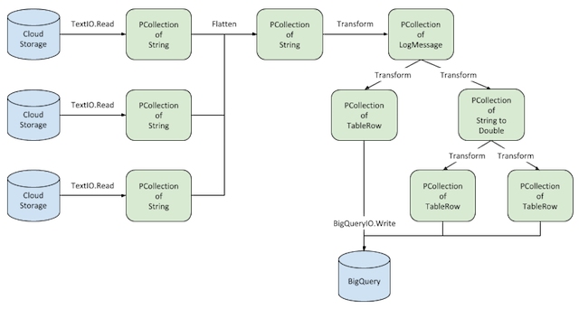

# Processing Logs at Scale Using Cloud Dataflow

This tutorial demonstrates how to use [Google Cloud Dataflow](http://cloud.google.com/dataflow) to analyze logs collected and exported by [Google Cloud Logging](http://cloud.google.com/logging). The tutorial highlights support for batch and streaming, multiple data sources, windowing, aggregations, and [Google BigQuery](http://cloud.google.com/bigquery) output.

For details about how the tutorial works, see [Processing Logs at Scale Using Cloud Dataflow](http://cloud.google.com/solutions/processing-logs-at-scale-using-dataflow) on the Google Cloud Platform website.

## Prerequisites

* [Java JDK](http://www.oracle.com/technetwork/java/javase/downloads/index.html) (version 1.7 or greater)
* [Maven](http://maven.apache.org) (version 3 or greater)
* A [Google Cloud Platform](http://cloud.google.com) account
* Install and setup the [Google Cloud SDK](https://cloud.google.com/sdk/)

After installing the Google Cloud SDK, run `gcloud components update` to install or update the following additional components:

* BigQuery Command Line Tool
* Cloud SDK Core Libraries
* gcloud Alpha Commands
* gcloud Beta Commands
* gcloud app Python Extensions
* kubectl

Set your preferred zone and project:

    $ gcloud config set compute/zone [ZONE]
    $ gcloud config set project [YOUR-PROJECT-ID]

Ensure the following APIs are enabled in the [Google Cloud Console](https://console.developers.google.com/). Navigate to **API Manager** and enable:

* BigQuery
* Google Cloud Dataflow
* Google Cloud Logging
* Google Cloud Pub/Sub
* Google Cloud Storage
* Google Container Engine

## Sample Web Applications

The `services` folder contains three simple applications built using [Go](http://golang.org) and the [Gin](https://github.com/gin-gonic/gin) HTTP web framework. These applications generate the logs to be analyzed by the Dataflow pipeline. The applications have been packaged as Docker images and are available through [Google Container Registry](https://gcr.io). **Note:** If you are interested in editing/updating these applications, refer to the [README](https://github.com/GoogleCloudPlatform/dataflow-log-analytics/tree/master/services).

In the `services` folder, there are several scripts you can use to facilitate deployment, configuration, and testing of the sample web applications.

### Deploy the Container Engine cluster

First, change the current directory to `services`:

    $ cd processing-logs-using-dataflow/services

Next, deploy the Container Engine cluster with the sample web applications:

    $ ./cluster.sh [YOUR-PROJECT-ID] [CLUSTER-NAME] up

The script will deploy a single-node Container Engine cluster, deploy the web applications, and expose the applications as Kubernetes services.

### Set up Cloud Logging

The next step is to configure Cloud Logging to export the web application logs to Google Cloud Storage. The following script first creates a Cloud Storage bucket, configures the appropriate permissions, and sets up automated export from the web applications to Cloud Storage. **Note:** the `BUCKET-NAME` should not be an existing Cloud Storage bucket.

    $ ./logging.sh [YOUR-PROJECT-ID] [BUCKET-NAME] batch up

### Generate requests

Now that the applications have been deployed and are logging through Cloud Logging, you can use the following script to generate requests against the applications:

    $ ./load.sh [REQUESTS] [CONCURRENCY]

This script uses Apache Bench [ab](https://httpd.apache.org/docs/2.2/programs/ab.html) to generate load against the deployed web applications. `REQUESTS` controls how many requests are issued to each application and `CONCURRENCY` controls how many concurrent requests are issued. The logs from the applications are sent to Cloud Storage in hourly batches, and it can take up to two hours before log entries start to appear. For more information, see the [Cloud Logging documentation](https://cloud.google.com/logging/docs/export/using_exported_logs).

### Examining logs

For information on examining logs or log structure in Cloud Storage, see the [Cloud Logging documentation](https://cloud.google.com/logging/docs/export/using_exported_logs#log_entries_in_google_cloud_storage).

## Cloud Dataflow pipeline

The following diagram shows the structure and flow of the example Dataflow pipeline:

### Create the BigQuery dataset

Before deploying the pipeline, create the BigQuery dataset where output from the Cloud Dataflow pipeline will be stored:

    $ bq mk [DATASET-NAME]

### Run the pipeline

First, change the current directory to `dataflow`:

    $ cd processing-logs-using-dataflow/dataflow

Next, Run the pipeline. Replace `BUCKET-NAME` with the same name you used for the logging setup:

    $ ./pipeline.sh [YOUR-PROJECT-ID] [DATASET-NAME] [BUCKET-NAME] run

This command builds the code for the Cloud Dataflow pipeline, uploads it to the specified staging area, and launches the job. To see all options available for this pipeline, run the following command:

    $ ./pipeline.sh

### Monitoring the pipeline

While the pipeline is running, you can see its status in the [Google Developers Console](https://console.developers.google.com). Navigate to **Dataflow** and then click the running job ID. You can see a graphical rendering of the pipeline and examine job logging output along with information about each pipeline stage. Here is an example screenshot of a running Cloud Dataflow job:

### View BigQuery data

After the job has completed, you can see the output in the [BigQuery console](https://bigquery.cloud.google.com) and compose and run queries against the data.

## Cleaning up

To clean up and remove all resources used in this example:

1. Delete the BigQuery dataset:

        $ bq rm [DATASET-NAME]

1. Deactivate the Cloud Logging exports. This step deletes the exports and the specified Cloud Storage bucket:

        $ cd processing-logs-using-dataflow/services
        $ ./logging.sh [YOUR-PROJECT-ID] [BUCKET-NAME] batch down

1. Delete the Container Engine cluster used to run the sample web applications:

        $ cd processing-logs-using-dataflow/services
        $ ./cluster.sh [YOUR-PROJECT-ID] [CLUSTER-NAME] down
